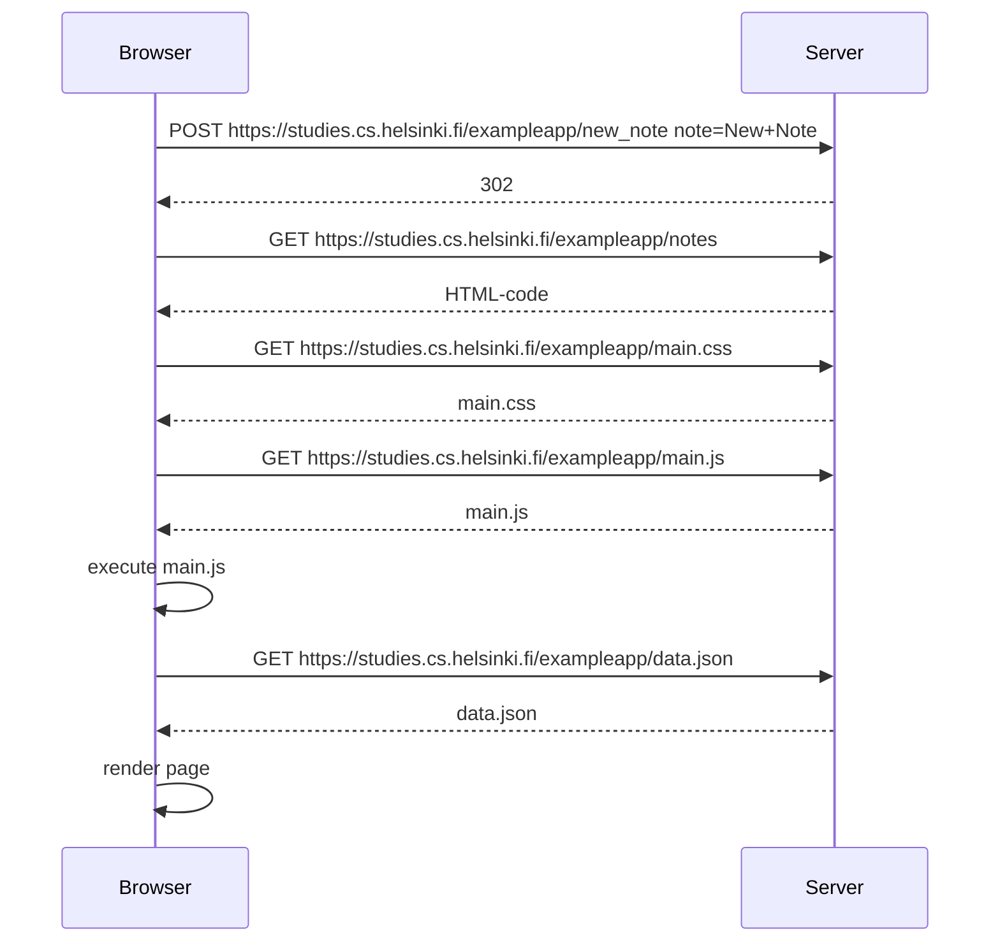

# New Note Sequence Diagram

```mermaid
  sequenceDiagram
    participant B as Browser
    participant S as Server
    
    B ->> S: POST https://studies.cs.helsinki.fi/exampleapp/new_note note=New+Note
    S -->> B: 302
    B ->> S: GET https://studies.cs.helsinki.fi/exampleapp/notes
    S -->> B: HTML-code
    B ->> S: GET https://studies.cs.helsinki.fi/exampleapp/main.css
    S -->> B: main.css
    B ->> S: GET https://studies.cs.helsinki.fi/exampleapp/main.js
    S -->> B: main.js
    B ->> B: execute main.js
    B ->> S: GET https://studies.cs.helsinki.fi/exampleapp/data.json
    S -->> B: data.json
    B ->> B: render page
```
