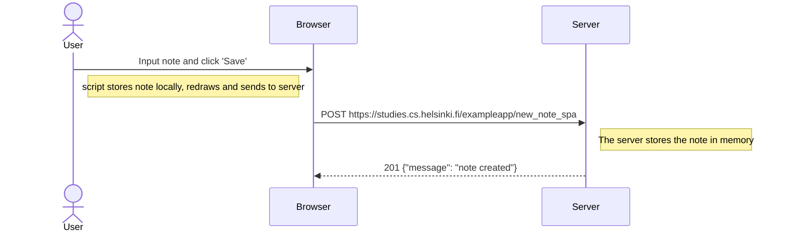

# Single Page App "New Note" Sequence

```mermaid
  sequenceDiagram
    actor U as User
    participant B as Browser
    participant S as Server
    
    U ->> B: Input note and click 'Save'
    note left of B: script stores note locally, redraws and sends to server
    B ->> S: POST https://studies.cs.helsinki.fi/exampleapp/new_note_spa
    note right of S: The server stores the note in memory
    S -->> B: 201 {"message": "note created"}
```
